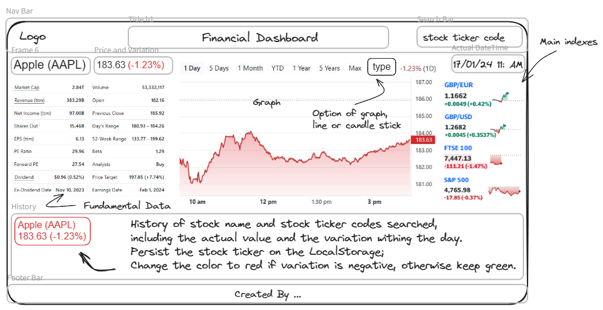

# Finance Dashboard-finX

## Description

This project provides a terminal-like data and information about the shares of publicly traded companies in real-time. It information can help those interested in the financial market to understand stock movement from time to time including past events, and trend analysis-through the chart of prices of shares of publicly traded companies.

## Table of Contents

* [Features](#features)
* [Link-to-website](#link-to-website)
* [Link-to-repo](#link-to-repo)
* [Authors](#authors)
* [Mock-Up](#mock-up)
* [License](#license)

## Functionality/Features
* Real-time analytics
* Historical chart analytics
* Stock ticker code search box
* Time and Date
* Popular currency pairs data
* Financial ratios
* Period based chart analytics

## Usage
To use this dashboard successfully, the stock ticker code for the company must be known and entered in a search box. This provide the results if the ticker code is correct.

## Link to website

## Link to repo

## Authors

## License
- This application is covered under: 
[MIT License](https://choosealicense.com/licenses/mit)

## Product

https://ukvirtfept112-y1j3057.slack.com/files/U063U3F7SVA/F06G8F6ACJC/finx-demo-gif.gif

## Design draft

P